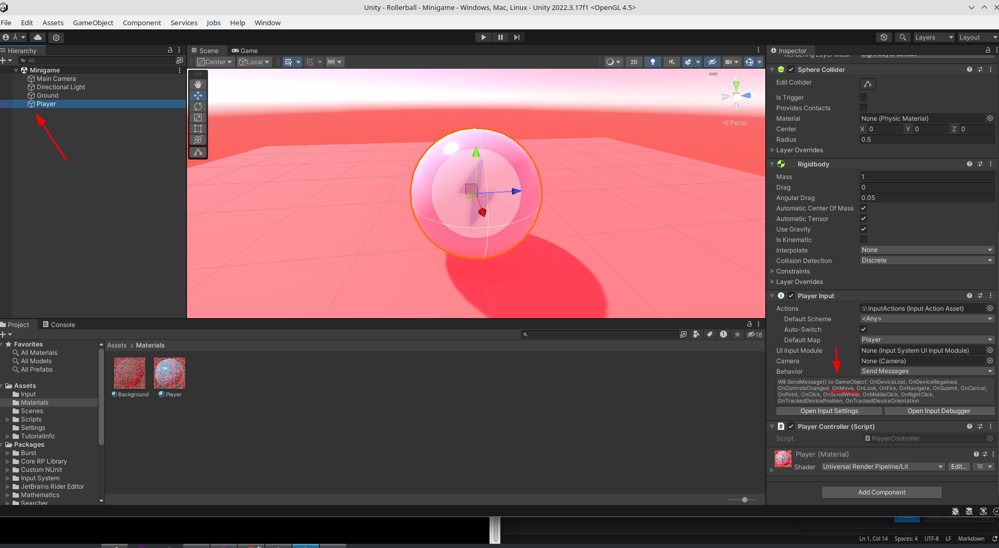

Metodo onMove


En este metodo la funcion va a leer el valor del input, por ejemplo arriba, abajo, derecha, izq...Y entonces mover la pelota en base a esos valores usando la funcion Update.

Tengo que añadir la funcion despues del start pero antes del final.

```
```
