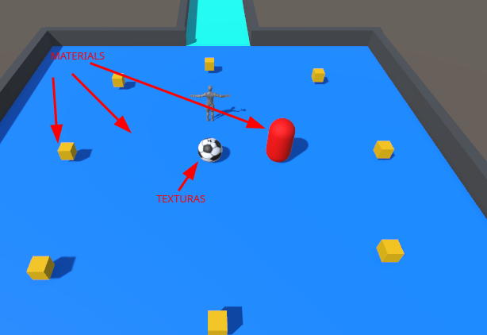
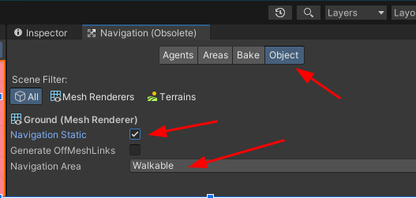
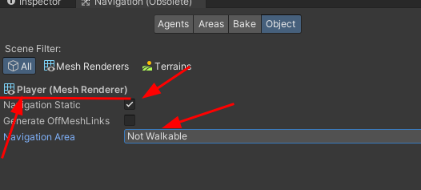
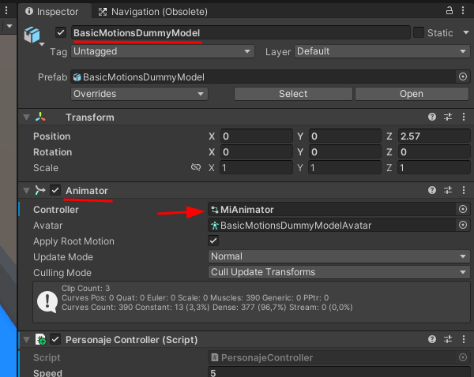
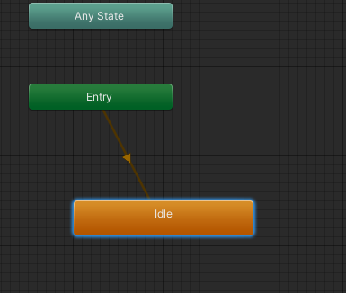
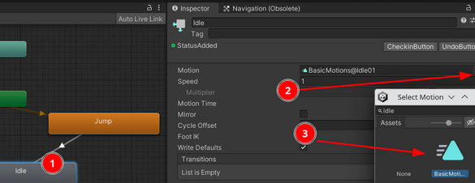
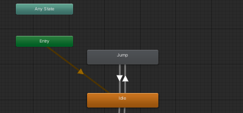

# Roll a Ball

## 1. Personalización tablero	

Primero tengo que crear una carpeta dentro de mi proyecto
en `./Assets` con el nombre `Materials`. Dentro de esta carpeta
iré introduciendo todas las texturas/materiales que le vayan a cambiar
el aspecto visual de los objetos.

### Materials

Para crear los materiales sólo tenemos que hacer click derecho
sobre la ventana de dentro del repositorio donde queramos guardar ese `Material`. En el menú contextual seleccionamos `Create` y posteriormente
`Material`. Renombramos el `Material` y personalizamos los parámetros. En mi caso, los colores los personalizo introduciendo las secuencia RGB y el parámetro Smoothness lo reduzco a 0,25.

Para aplicar el `Material` simplemente arrastro el mismo al objeto que deseo que aplique ese `Material`.


### Texturas

Para crear las texturas arrastro una imagen a dentro de la 
carpeta Materials. Para aplicarlo se hace de la misma forma que el `Material`

Resultado:



## 2. Enemigo
Siguiendo [este](https://itnext.io/it-follows-creating-zombie-enemies-in-unity-part-3-of-unity-gamedev-series-988da87c8273) tutorial realicé los siguiente pasos:

1. Creo objeto tipo `Capsule`
2. Descargo paquete "AI Navigarion" en el Package Manager

### Navigation

Nos dirigioms a esta ventana y aplicamos los 
siguientes cambios para

#### A. Suelo



#### B. Otros objetos



Esto se hace para que NO sea traspasable como paredes, jugador etc.


### Añadimos inteligencia al enemigo

Añadimos componente NavMeshAgent.Con esto le decimos que el puede caminar. Ahora solo hay que decirle que es lo que tiene que seguir.

### Asignamos Script al enemigo

```c#
using UnityEngine;
using UnityEngine.AI;
public class Enemy : MonoBehaviour
{
    private NavMeshAgent pathfinder;
    private Transform target;
    
    void Start()
    {
        pathfinder = GetComponent<NavMeshAgent>();
        // obj que va a perseguir
        target = GameObject.Find("Player").transform;
    }
    void Update()
    {
        pathfinder.SetDestination(target.position);
    }
}
```

### Blake

Por último nos dirigimos de nuevo a la ventana Navigation del suelo, pestaña Blake, botón clear y después Bake.  Para lo que sirve el blake es para hacer la maya


## 3. Animation

Importamos el paquete **Basic Motions FREE** en Asset Store.

Arrastramos de la carpeta Models el obj `BasicMotionDummyModel` al menú Hierarchy.

> Ya viene con el componente Animator predefinido, si crearamos un personaje desde cero, esto lo tendríamos que añadir al objeto en el inspector con Add Component.

En el Animator hay que asignarle un controller. Para ello primero creamos una carpeta Animations donde vamos a guardar las animaciones. Creamos una animación simplemente haciendo click derecho en la ventana de esa carpeta: Create, Animation Controller. Por último arrastramos el fichero al parámetro controller:




### Configuracion de la `Animation Controller`

#### A. Idle

Doble click sobre el `Animation Controller` creado y nos dirige directametne al menú Animator. Aquí nos muestra un esquema de los estados y transiciones del objeto (como un diagrama de flujo).

Creamos el primer estado haciendo click derecho
sobre el esquema al que llamamos `Idle`. Este va a ser el primer estado al que va a recurrir el objeto una vez se inicie el juego, el estado de reposo.



#### B. Jump

1. Creamos un nuevo estado llamado `Jump`.
2. Creamos una transicion haciendo click sobre un estado, make transition y uniéndolo a otro.

Esta transicion no va a funcionar si no tiene parámetros. Estos param los vamos a utilizar en las condiciones de las animaciones. Por lo que creamos un parámetro booleano y lo asignamos a la condicion del estado.

3. Seleccionamos de nuevo el estado y le asignamos un `Motion`, que es el que hace la animación



> En este caso muestro la de Idle pero la de Jump sería igual

3. Por ultimo realizamos la transión de vuelta del estado Jump al estado Idle añadiendole como dondición el mismo parámetro con el booleano contrario.



### Script de la animation

Añadimos el script a la animacion que haga que cuando presionemos la tecla de espacio el personaje salte.

A destacar

```c#
// conseguimos el input
if(Input.GetKey(KeyCode.Space)) {
    // cambiamo param en caso de se introduzca el input
            animator.SetBool("isJumping", true);
} else {
    // cd dejamos de presionar, cambia de nuevo el param y se realiza la transicion al estado Idle
            animator.SetBool("isJumping", false);
}
```


